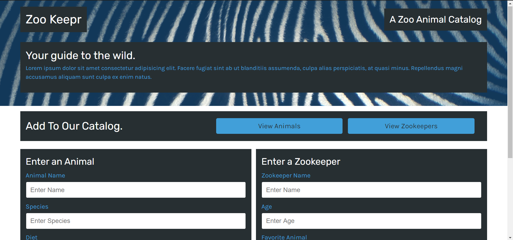
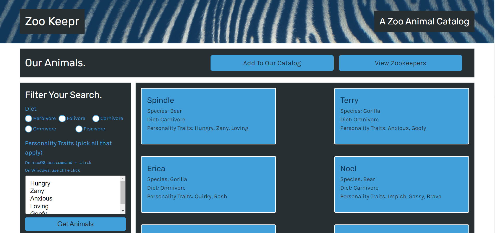
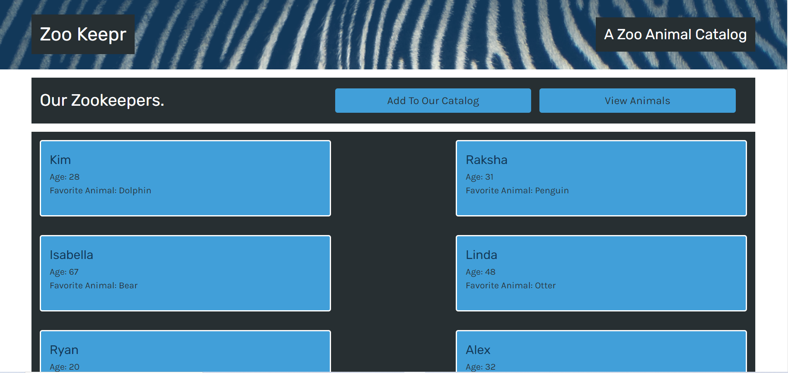

# zookeepr

## Description
A zoo animal catalog that allows users to add and track zoo animals and zoo keepers.  User-friendly interface allows easy input of details related to both animals and their keepers.

##### Homescreen

##### View

##### View

Visit site [here](https://zookeepr-xo.herokuapp.com/)

## Table of Contents
  * [Installation](#installation)
  * [Usage](#usage)
  * [License](#license)
  * [Technologies](#technologies)
  * [Contributing](#contributing)
  * [Testing](#testing)
  * [Questions](#questions)
  
## Installation
Clone project to a directory on your local machine and cd into zookeepr directory.  Run <$ npm install> to install dependencies.  See package.json for other available scripts.

## Usage
Run <$ npm start> to launch application on development server at localhost:3001.  Click on buttons to view animal or zookeeper details.  Enter animal or zookeeper details into their respective forms to add to the catalog.  

## License 
This project is covered under the MIT license 

## Technologies 
HTML5, CSS3, JavaScript, Node.js, Express

## Contributing
To see the guidelines adopted for contributing to this project, please view the [Contributor Covenant](https://www.contributor-covenant.org/version/2/0/code_of_conduct/code_of_conduct.txt)

## Testing
Tests coming soon

## Questions
Visit me at GitHub  
[christopherConcannon](https://github.com/christopherConcannon)
  
If you have any questions or would like to contact me, please email me at  
[cmcon@yahoo.com](mailto:cmcon@yahoo.com)
